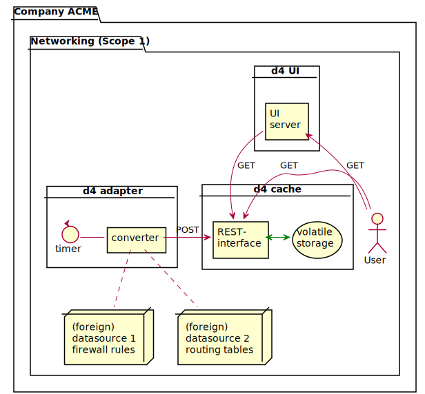
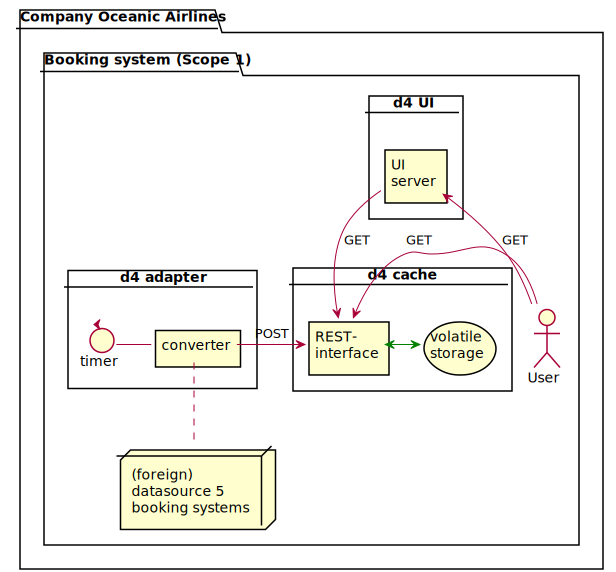
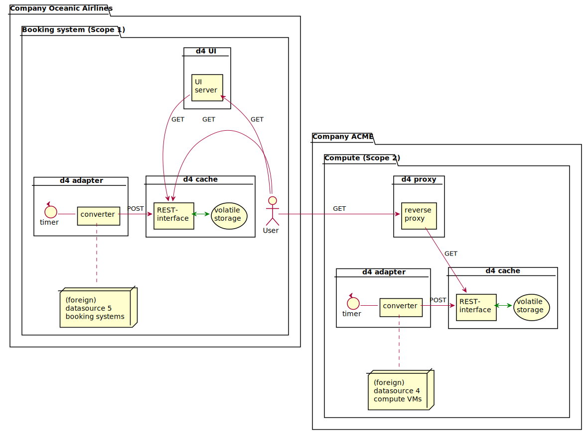

# Small introduction to the d4 landscape

## A very first insight

We have a company "ACME" with a network department:

> **Hint**:
> _company_ is a "context of same ownership".
> All data in this context is owned by this company.

Let's assume
 * _datasource 1_ are the firewall rules and
 * _datasource 2_ are the routing tables.

> **Hint**:
> _scope_ is a "context of same permission".
> All data in this context are subject to the same access rights.

Data from different products or sources must be converted into an open, standardised (JSON-LD) format.
This is the task of _d4 adapter_.

Ok, now it's converted but where should it go? It should be saved.
For this we need a _d4 cache_ with a volatile storage.

So now we store data from _datasource 1_ in a _d4 cache_, but we cannot see or query this data.

## No fun without users

We need a way for a _user_ to query it via the _d4 UI_ user interface.

> **Hint**:
> The user has access to the UI and REST interface.
> Modern web frameworks such as react work like this.

Now we have three µServices (_d4 UI_, _d4 adapter_, _d4 cache_) in this _scope_ 'Networking'
but no connection to the outside world.

So the data do not come out of the _scope_. We are changing that now.

With the necessary rights (it is a different _scope_), the _user_ can now access the data.

> **Hint**:
> The _user_ does not have access to a user interface here
> but can work directly with the REST interface.

## Only one _scope_ is boring

Let's think a little bigger

The user can now access data from both _datasource 1_ and _datasource 2_ from different _scopes_.

## Now take off a little

Let's add a new _company_ "Oceanic Airlines".

The _user_ can find out here which booking systems are running, but not where.

## Nothing works without ground station

The _company_ "Oceanic Airlines" obtains its services from "ACME".

We expand the picture with possibilities to retrieve this information as well.

Now the _user_ can determine what booking systems are running and where.
