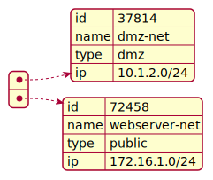

# Data structures

## A first example of data from the ACME network

Let us assume that there are two networks in which web servers (public)
and database servers (in demilitarised zone) are working.

will be continued...